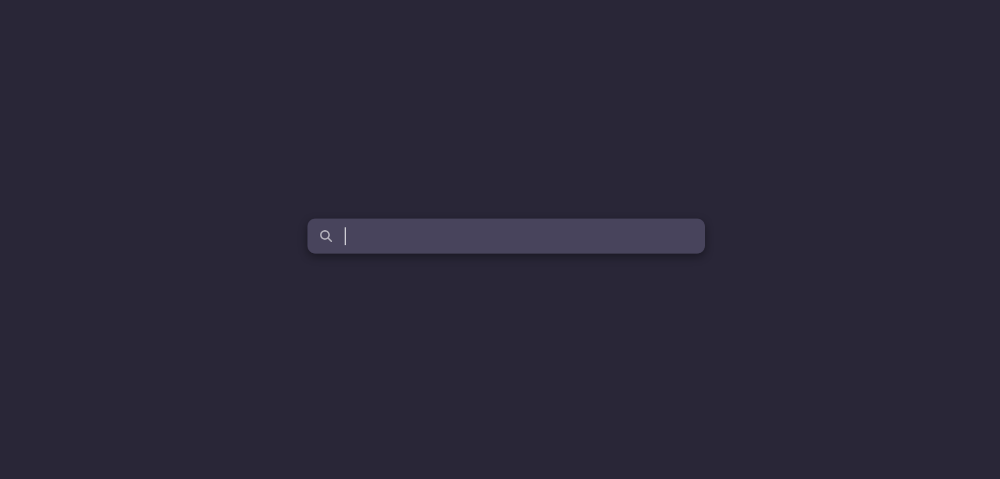

# 🌟 TabY

> A modern, minimal new tab extension that puts *you* back in control — no distractions, no clutter, just a clean slate.

---

 <!-- Replace with your actual screenshot -->

## ✨ Features

- 🧘‍♂️ **Distraction-Free Design** – Say goodbye to chaos. TabY gives you an empty, peaceful new tab page.
- ⚡ **Lightning Fast** – Loads in a blink. Minimal assets = blazing performance.
- 🎯 **Productivity First** – No widgets. No ads. Just a blank canvas for focus.
- 🎨 **Dark Mode Ready** – Automatically respects your browser theme.

---

## 🚀 Getting Started

1. **Clone the repo**  
   ```bash
   git clone https://github.com/yourusername/TabY.git
   ```

2. **Load it into your browser**  
   - Go to `chrome://extensions/`
   - Enable "Developer mode"
   - Click “Load unpacked” and select the `TabY` folder

3. ✅ Done! Open a new tab and enjoy the zen.

---

## 🛠️ Customization

TabY is made for tinkerers too.

- Want a quote of the day? A to-do list? A background image?  
  Fork it and make it yours! This is your tab, your rules.

---

## 📁 Project Structure

```
TabY/
├── icons/              # Extension icons
├── index.html          # Main new tab page
├── manifest.json       # Chrome extension config
└── styles.css          # Minimal styling
```

---

## 🧠 Why TabY?

Because not every new tab needs to yell at you.  
Sometimes, all you need is… **nothing**.

---

## 🌍 Browser Support

- ✅ Chrome  
- 🔜 Firefox (coming soon)

---

## 🤝 Contributing

Found a bug? Want to add a feature? PRs welcome!

1. Fork the repo
2. Create your branch: `git checkout -b feature-name`
3. Commit: `git commit -m 'Add cool feature'`
4. Push: `git push origin feature-name`
5. Open a pull request

---

## 📄 License

MIT © [YourName](https://github.com/yourusername)

---

## 🙌 Acknowledgements

Inspired by a love of clean interfaces and hate of clutter.
